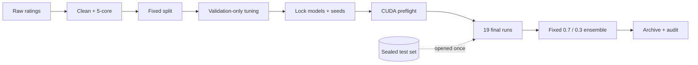

<div align="center">

# 🎬 Anime Top‑N Recommender

### Reproducible collaborative filtering, leakage-safe evaluation, and a bilingual visual demo

[](https://www.python.org/)
[](https://pytorch.org/)
[](demo/README.md)
[](tests/)
[](evidence/final_result_report_2026-09-05.md)

**[English](#overview) · [中文](#中文简介) · [Experiment report](evidence/final_result_report_2026-09-05.md) · [Demo guide](demo/README.md)**

</div>

---

## Overview

This project builds and evaluates a model-based anime recommender on the
Anime Recommendations Database. It compares classical and neural collaborative
filtering methods, locks every model-selection decision on validation data, and
opens the test set only once for the final campaign.

The finished system combines **BPR** and **Weighted NeuMF** with a fixed
percentile-rank ensemble. A local Streamlit app turns the frozen model into a
simple showcase: choose one of 20 anonymous users and receive ten unseen anime
recommendations with posters.

<div align="center">

| 👥 Eligible users | 🎞️ Warm catalog | 🧪 Formal runs | 🖥️ Final compute |
|:---:|:---:|:---:|:---:|
| **60,384** | **7,223 anime** | **19/19 passed** | **2 × RTX A6000** |

</div>

## Final results

The locked ensemble achieved the strongest result on both reported metrics.

| System | Test NDCG@10 ↑ | Test HR@10 ↑ |
|---|---:|---:|
| **BPR + Weighted NeuMF (`0.7 / 0.3`)** | **0.799658 ± 0.000259** | **0.956335 ± 0.000843** |
| Weighted NeuMF | 0.783825 ± 0.000137 | 0.946862 ± 0.003018 |
| BPR | 0.770767 ± 0.000330 | 0.952703 ± 0.000526 |
| NeuMF | 0.765100 ± 0.000851 | 0.947094 ± 0.000734 |
| GMF | 0.716820 ± 0.002421 | 0.935043 ± 0.001161 |
| MLP | 0.716791 ± 0.000522 | 0.936037 ± 0.000538 |
| Popular | 0.507031 | 0.771761 |

> [!IMPORTANT]
> These are warm-user offline results with **one held-out positive and 99 fixed
> sampled negatives** per user. They are not full-catalog accuracy, online CTR,
> or a claim about cold-start users.

## Experiment at a glance



The governing rule is **validation chooses; test reports**. Models,
hyperparameters, seeds, and the ensemble weight were frozen before test
evaluation. See the [visual experiment walkthrough](docs/EXPERIMENT_PIPELINE_OVERVIEW.md)
for the complete chain and its gates.

## Interactive demo

The offline demo is intentionally focused on one task:

1. Switch the interface between **中文** and **English**.
2. Select one of 20 anonymous users from the prepared dataset.
3. Inspect a small sample of that user's observed anime history.
4. View a full-catalog Top‑10 generated by the frozen ensemble.

Posters are presentation metadata only—they never enter model scoring. The
private demo bundle, checkpoints, cached posters, and interaction data are
excluded from Git.

```bash
python -m pip install -e ".[demo]"
python -m streamlit run demo/app.py
```

The app requires a locally prepared `demo_bundle/`. Follow the
[demo setup guide](demo/README.md) to build it and verify its manifest hashes.

## Models

| Model | Role |
|---|---|
| Popular | Non-personalized baseline |
| BPR | Pairwise latent-factor ranking |
| GMF | Generalized matrix factorization |
| MLP | Nonlinear user–item interaction baseline |
| NeuMF | Joint GMF and MLP architecture |
| Weighted NeuMF | Confidence-weighted neural recommender |
| Locked ensemble | Per-user percentile blend of BPR and Weighted NeuMF |

## Reproducible evaluation contract

- Ratings `≥ 7` define positive interactions.
- Ambiguous duplicate user–item pairs are removed.
- Iterative 5-core filtering retains warm users and warm items.
- Every user contributes one validation positive and one test positive.
- All models rank the same held-out positive against the same 99 unseen negatives.
- Development tuning uses one fixed 10,000-user subset and never evaluates test.
- Three final seeds (`42`, `43`, `44`) provide descriptive stability evidence.
- Source commits, schemas, manifests, logs, and SHA-256 records provide an audit trail.

## Quick start

Python 3.11 or newer is required.

```bash
python -m pip install -e ".[dev]"
python -m pytest
```

Prepare a reproducible split:

```bash
python -m src.prepare \
  --ratings /path/to/rating.csv \
  --output artifacts/anime-r7 \
  --positive-threshold 7 \
  --core-size 5 \
  --seed 42 \
  --negative-count 99 \
  --development-user-count 10000
```

Run a baseline or validate a tuning plan:

```bash
python -m src.train --config configs/anime_popular.yaml
python -m src.tune --plan configs/tuning/anime_stage_a.yaml --dry-run
```

For the pinned CUDA 12.1 environment and the full sequence of experiment
commands, use [EXPERIMENTS.md](EXPERIMENTS.md).

## Repository map

```text
dam/
├── configs/      # Training, tuning, selected, and final configurations
├── demo/         # Bilingual Streamlit UI and offline inference code
├── docs/         # Experiment explanations and operational runbooks
├── evidence/     # Gates, hashes, and final result records
├── ops/          # Credential-free final-run helpers
├── src/          # Data, models, training, evaluation, and ensembles
└── tests/        # Reproducibility and inference tests
```

## Limitations

- The experiment covers known warm users and warm catalog items; cold start is outside scope.
- Three seeds describe stability but do not establish broad statistical significance.
- Sampled-candidate ranking is easier than ranking all 7,223 items.
- Poster availability and metadata quality affect presentation, not recommendations.
- The demo is a local academic showcase, not a production serving system.

## 中文简介

本项目在 Anime Recommendations Database 上完成了一条可复核的动漫推荐实验链路：
从数据清洗、固定划分、验证集调参、候选锁定、双 GPU 正式训练，到一次性测试集评估、
结果归档与 Git 留痕。核心原则是：**验证集负责选择，测试集只负责最终报告**。

最终系统采用固定权重 `0.7 / 0.3`，融合 BPR 与 Weighted NeuMF，在
`1 个正样本 + 99 个固定负样本` 的测试协议下取得：

- **NDCG@10：0.799658 ± 0.000259**
- **Hit Rate@10：0.956335 ± 0.000843**

项目还提供一个中英双语 Streamlit 展示系统。用户可以选择 20 位匿名用户之一，
查看部分历史动漫，并获得带海报的全目录 Top‑10 推荐。动漫标题和类别保留数据集
原始字段；海报仅用于展示，不参与模型输入和排序。

更完整的项目资料请查看：
[实验全链路概览](docs/EXPERIMENT_PIPELINE_OVERVIEW.md) ·
[Demo 使用说明](demo/README.md) ·
[最终结果报告](evidence/final_result_report_2026-09-05.md)

---

<div align="center">

Built as an auditable data-mining and recommender-systems project.

</div>
