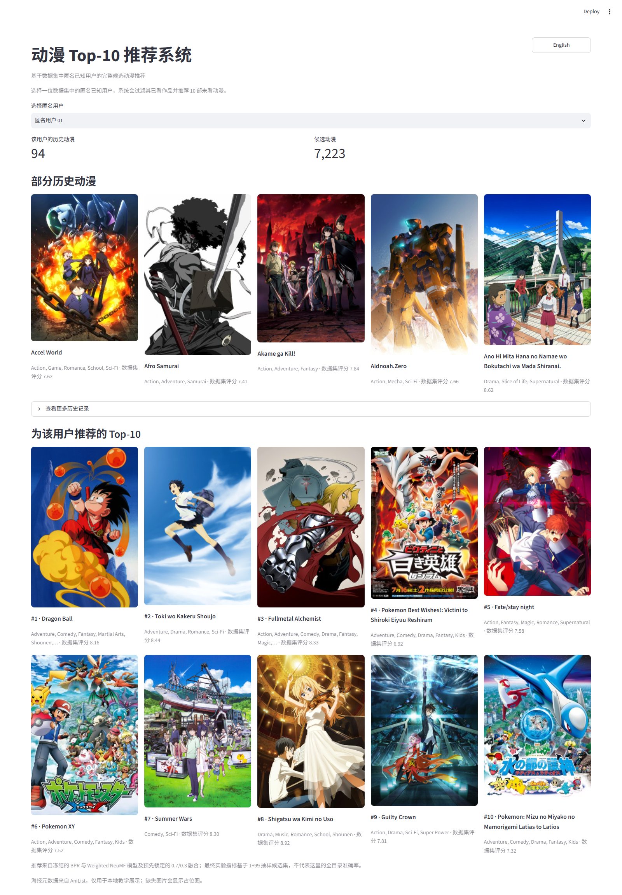
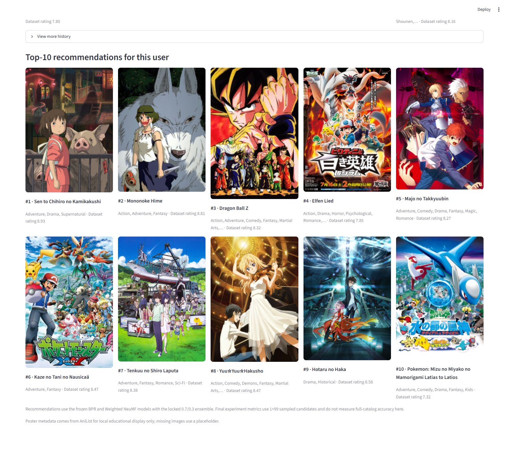

<div align="center">

# Recommender-System Technical Review

SC4020 Data Analytics and Mining

[](https://www.python.org/)
[](https://pytorch.org/)
[](demo/README.md)

SC4020 Project 1: a team review of recommender-system methods. The model-based
workstream uses the Anime Recommendations Database and MovieLens 1M.

</div>

## Team scope

[`tasks.txt`](tasks.txt) records the four assigned workstreams: content-based,
user-user neighbourhood, item-item neighbourhood, and model-based methods.
The current `main` item-item [notebook](item_item_collab/item_item_collab.ipynb)
is a small-sample prototype. The results below belong to the model-based
workstream; they are not a completed comparison of all four workstreams.
The [team framework](docs/PROJECT1_TEAM_FRAMEWORK.md) maps the course
requirements to each workstream and explains how to integrate results. Each
owner can use the [handoff template](docs/WORKSTREAM_HANDOFF_TEMPLATE.md)
when their method is ready for review.

## Model-based workstream

| Users | Anime | Final runs | Hardware |
|---:|---:|---:|---:|
| 60,384 | 7,223 | 19 | 2 × RTX A6000 |

Models evaluated: Popular, BPR, GMF, MLP, NeuMF and Weighted NeuMF.

Final model: **0.7 BPR + 0.3 Weighted NeuMF** using per-user percentile ranks.

## Results

| Model | NDCG@10 | Hit Rate@10 |
|---|---:|---:|
| **BPR + Weighted NeuMF** | **0.799658 ± 0.000259** | **0.956335 ± 0.000843** |
| Weighted NeuMF | 0.783825 ± 0.000137 | 0.946862 ± 0.003018 |
| BPR | 0.770767 ± 0.000330 | 0.952703 ± 0.000526 |
| NeuMF | 0.765100 ± 0.000851 | 0.947094 ± 0.000734 |
| GMF | 0.716820 ± 0.002421 | 0.935043 ± 0.001161 |
| MLP | 0.716791 ± 0.000522 | 0.936037 ± 0.000538 |
| Popular | 0.507031 | 0.771761 |

Evaluation: one held-out positive and 99 fixed negatives per warm user.

The locked MovieLens 1M transfer is also complete: 6,034 warm users, 13 formal
runs and the same fixed ensemble. Its sampled-candidate test NDCG@10 is
**0.632039 ± 0.003126** and HR@10 is **0.838692 ± 0.003120**. Anime and
MovieLens results have different user/item populations and positive thresholds;
compare model order and within-dataset gains rather than their absolute scores.
See the [MovieLens transfer report](evidence/movielens_transfer_results_20260928.md).

## Demo

- 20 anonymous users
- Chinese / English interface
- Viewing-history preview
- Full-catalog Top-10 recommendations
- Locally cached anime posters

The screenshots below come from the running offline demo. They show anonymous
known users; the formal NDCG and Hit Rate above use a separate 100-candidate
test protocol.

[](docs/images/demo-overview-zh.png)

<details>
<summary>English view: Top-10 recommendations for another anonymous user</summary>

[](docs/images/demo-recommendations-en.png)

</details>

```bash
python -m pip install -e ".[demo]"
python -m streamlit run demo/app.py
```

The local `demo_bundle/` is required and is not stored in Git. See
[demo/README.md](demo/README.md) for setup.

## Development

The Anime and MovieLens formal campaigns are complete. The MovieLens
[preparation checkpoint](evidence/movielens_local_preparation_20260926.md)
documents the earlier data and configuration gate.

```bash
python -m pip install -e ".[dev]"
python -m pytest
```

```text
configs/      experiment configurations
demo/         Streamlit demo and offline inference
docs/         experiment notes and runbooks
evidence/     final results and verification records
item_item_collab/  item-item prototype notebook
ops/          final-run scripts
src/          models, training and evaluation
tests/        automated tests
```

## Documentation

- [Anime report figures and captions](docs/30_LIJIE_ANIME_REPORT_FIGURES.md)
- [Project 1 team framework](docs/PROJECT1_TEAM_FRAMEWORK.md)
- [Workstream handoff template](docs/WORKSTREAM_HANDOFF_TEMPLATE.md)
- [Anime results and discussion draft](docs/31_LIJIE_ANIME_RESULTS_DISCUSSION_DRAFT.md)
- [Methods and experimental setup](docs/32_LIJIE_METHODS_AND_EXPERIMENTAL_SETUP.md)
- [Verified final parameter tables](docs/33_LIJIE_FINAL_PARAMETER_TABLES.md)
- [MovieLens transfer results and cases](evidence/movielens_transfer_results_20260928.md)
- [MovieLens and report closeout runbook](docs/29_LIJIE_MOVIELENS_AND_REPORT_CLOSEOUT_RUNBOOK.md)
- [Experiment overview](docs/EXPERIMENT_PIPELINE_OVERVIEW.md)
- [Experiment commands](EXPERIMENTS.md)
- [Final result report](evidence/final_result_report_2026-09-05.md)
- [Demo setup](demo/README.md)

Generated data, checkpoints, predictions, poster caches and credentials are
excluded from this repository.
