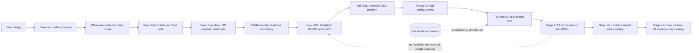
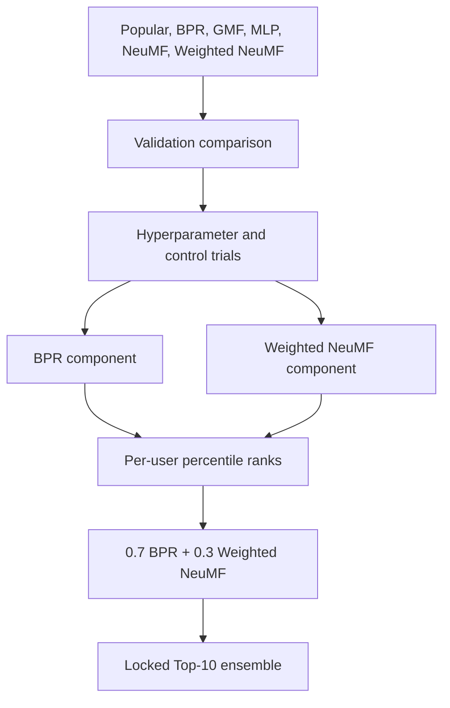
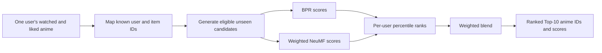

# Anime recommendation experiment: end-to-end overview

This page explains what the completed experiment did, why each stage existed,
and where information was deliberately prevented from flowing backward.

## The whole chain at a glance

The critical idea is simple: **validation chooses; test reports**. The test set
stayed sealed throughout model and hyperparameter decisions. It was opened once
after the candidates, seeds, ensemble formula, and weight were frozen.

## What each stage answered

| Stage | Question answered | Main evidence or gate |
|---|---|---|
| Data preparation | Are all models solving exactly the same recommendation problem? | Stable manifest; 60,384 users, 7,223 items, fixed split and candidates |
| Baseline preflight | Can every model complete correctly and is the server adequate? | Validation-only metrics, finite loss, clean logs |
| Validation tuning | Which settings should be promoted without seeing test? | Shared 10,000-user development subset; fixed budgets and seeds |
| Candidate lock | What exactly will be evaluated in the final campaign? | BPR, Weighted NeuMF, other comparison models, three seeds, fixed `w=0.7` |
| Full-user preflight | Will the locked candidates work at final scale and actually use CUDA? | 60,384 users, one epoch, two RTX A6000 devices, GPU attach proof |
| Test unseal | Can the final run read test without changing anything else? | 19 configs changed only from `evaluate_test: false` to `true` |
| Formal Stage F | Did every declared run finish under the frozen protocol? | 19/19 schema gates, 18/18 GPU gates, no retry or timeout |
| Ensemble Stage G-H | Does the pre-declared blend improve the components? | Six derived artifacts and one validated final summary |
| Archive Stage I | Can another person audit what happened later? | Commit IDs, SHA-256 values, reports, metadata archive, credential cleanup |

## Data and evaluation contract

The raw ratings were converted into an implicit-feedback task:

- A rating of at least 7 is a positive interaction.
- Ambiguous duplicate user-item pairs are removed.
- Iterative 5-core filtering retains only warm users and warm items.
- Every eligible user contributes one validation positive and one test positive;
  the remaining positives form training data.
- Every evaluation ranks one held-out positive against 99 fixed unseen
  negatives. Every model receives the same candidates.

The frozen dataset contains 60,384 eligible users, 7,223 warm items, 5,087,394
training positives, 60,384 validation positives, and 60,384 test positives.
These numbers define the experiment's scope: the final scores measure ranking
within sampled 100-item candidate sets for warm users, not full-catalog or
online recommendation quality.

## Model-selection funnel

BPR captures pairwise collaborative preference structure. Weighted NeuMF adds
a nonlinear interaction model with confidence weighting. Their raw score
scales are different, so the ensemble first converts each model's scores to
per-user percentile ranks, then combines them with the already selected
`0.7 / 0.3` weights. No ensemble weight was searched after test unsealing.

## Why there were 19 runs but more result rows

The formal campaign contained 19 independently executed configurations:

- Popular: 1 deterministic run.
- BPR, GMF, MLP, NeuMF, and Weighted NeuMF: 3 seeds each, for 15 runs.
- BPR ensemble components: 3 additional seed-matched runs.

That totals `1 + 15 + 3 = 19`. Stage G-H then derived six ensemble files from
existing predictions: validation and test for each of three seeds. These are
derived results, not six new training runs.

## Final outcome

| System | Test NDCG@10 | Test HR@10 |
|---|---:|---:|
| Ensemble `w=0.7` | **0.799658 ± 0.000259** | **0.956335 ± 0.000843** |
| Weighted NeuMF | 0.783825 ± 0.000137 | 0.946862 ± 0.003018 |
| BPR | 0.770767 ± 0.000330 | 0.952703 ± 0.000526 |
| NeuMF | 0.765100 ± 0.000851 | 0.947094 ± 0.000734 |
| GMF | 0.716820 ± 0.002421 | 0.935043 ± 0.001161 |
| MLP | 0.716791 ± 0.000522 | 0.936037 ± 0.000538 |
| Popular | 0.507031 | 0.771761 |

The locked ensemble was best on both reported metrics and won for all three
seeds. The small validation-to-test gap supports stability under this fixed
sampled-candidate protocol. Three seeds still provide descriptive stability,
not a strong statistical-significance claim.

## What a real recommendation request produces

For a warm user and known catalog items, the system outputs a ranked Top-N list
of unseen anime IDs with ranking scores. Turning that into a product-facing list
of titles, posters, or explanations requires joining item metadata and defining
serving rules. A brand-new user with no usable history needs a cold-start
fallback such as popularity or content features; that case is outside this
collaborative-filtering experiment.

## The five safeguards to remember

1. **Same data contract:** all models use the same users, items, split, and candidates.
2. **No test leakage:** tuning is validation-only; test is opened once after locking.
3. **Real GPU evidence:** CUDA configuration plus process attachment and device monitoring.
4. **Reproducible identity:** source commits, manifests, schemas, and SHA-256 records.
5. **Clean handoff:** no generated bulk artifacts, machine coordinates, or credentials in Git.

For exact final values and caveats, see
[`../evidence/final_result_report_2026-09-05.md`](../evidence/final_result_report_2026-09-05.md).
